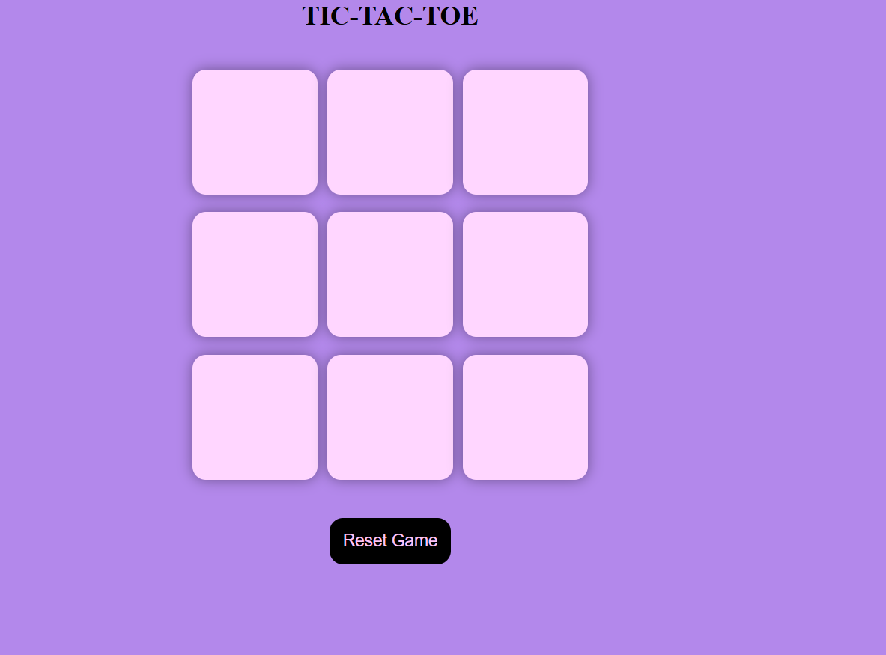
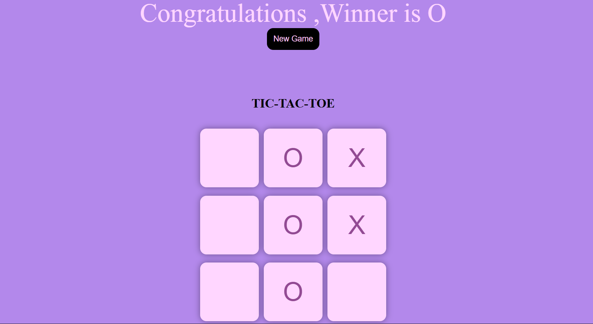

# Tic-Tac-Toe Game

A modern and interactive **Tic-Tac-Toe** game developed using **HTML, CSS, and JavaScript**. The game features a clean user interface, winner detection, and reset functionality for a smooth gaming experience.

---

## ✨ Features

 Two Player Gameplay (X vs O)  
 Automatic Winner Detection  
 Draw Detection  
 New Game / Reset Game Option  
 Attractive Purple UI Design  
 Responsive Layout  
 Simple and User-Friendly Interface

---

# 📸 Project Screenshots

##  Game Start

<p align="center">
  
</p>

---

##  Winner Screen

<p align="center">
  
</p>

---

# 🛠️ Tech Stack

- HTML5
- CSS3
- JavaScript (DOM Manipulation)

---

#  How to Run

1. Clone the repository

```bash
git clone https://github.com/your-username/Tic-Tac-Toe.git
```

2. Open the project folder.

3. Run **index.html** in your browser.

---

#  Project Structure

```
Tic-Tac-Toe/
│
├── index.html
├── style.css
├── game.js
├── game-start.png
├── winner-screen.png
└── README.md
```

---

#  Learning Outcomes

- DOM Manipulation
- Event Handling
- JavaScript Functions
- Arrays & Loops
- Game Logic Implementation
- CSS Styling & Layout Design

---

#  Future Enhancements

- AI Opponent
-  Dark Mode
-  Sound Effects
-  Score Board
-  Better Mobile Responsiveness

---

#  Author

**Kavya Tyagi**

Aspiring Software Developer | Passionate about Web Development and Java Programming

---

##  If you found this project helpful, please consider giving it a Star!
